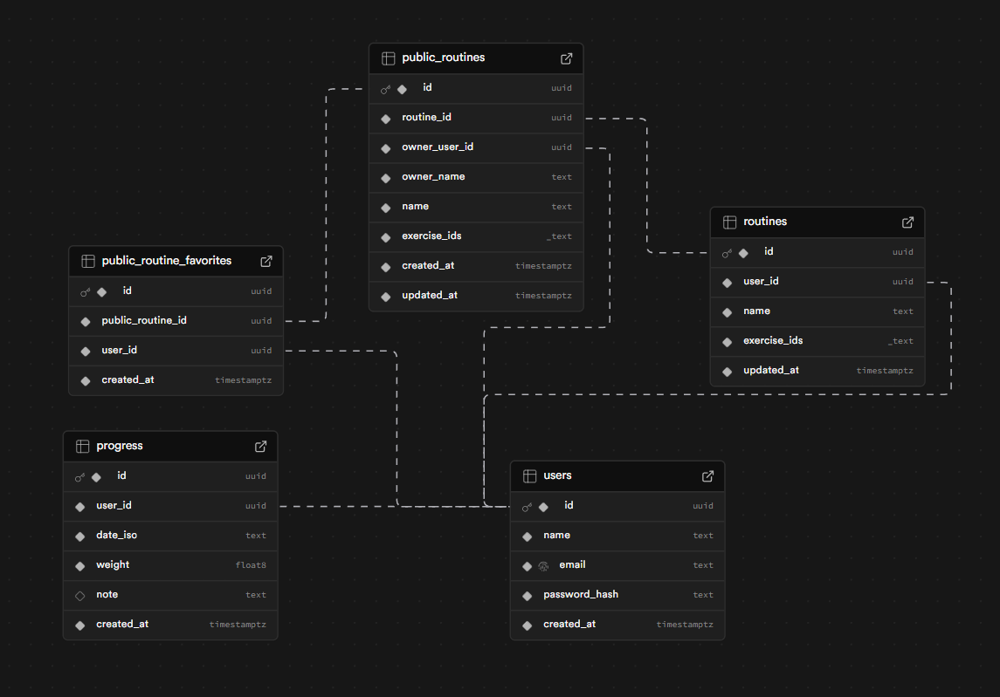
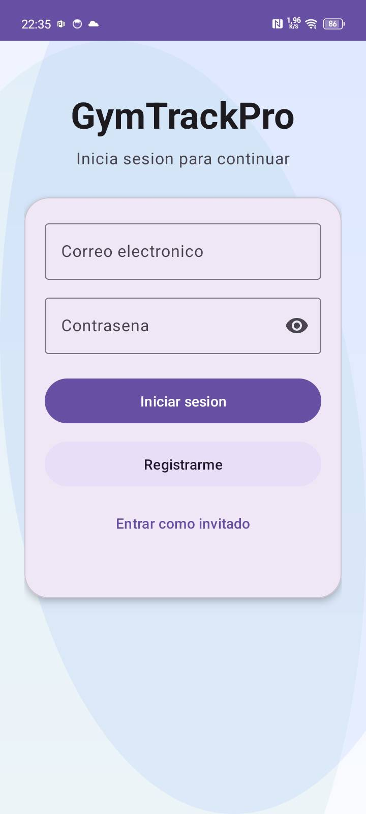
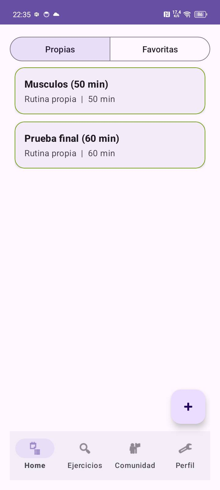
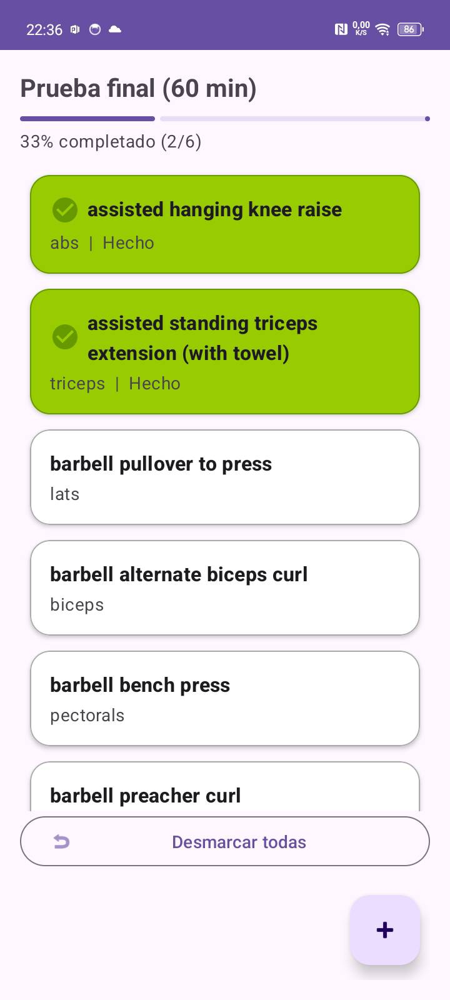
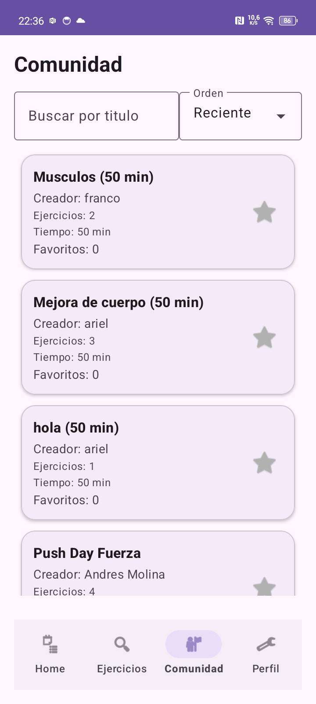

# GYMTRACKPRO

Aplicacion movil Android (Kotlin) orientada al seguimiento de rutinas de entrenamiento, con arquitectura MVVM, persistencia local offline-first y sincronizacion con backend remoto.

## Descripcion del Proyecto

GYMTRACKPRO permite:
- registro/login de usuarios y modo invitado,
- exploracion de ejercicios (API externa via backend),
- creacion y gestion de rutinas propias,
- guardado de rutinas favoritas de la comunidad,
- seguimiento de avance dentro de cada rutina (porcentaje de ejercicios completados).

La app usa base de datos local con Room para operar sin conexion y sincroniza con backend cuando hay red.

### Problema que resuelve

El proyecto resuelve la gestion integral de entrenamiento personal en un solo flujo:
- planificar rutinas,
- buscar ejercicios en catalogo externo,
- llevar avance por rutina,
- compartir rutinas y descubrir comunidad.

Evita depender de notas separadas o apps sin sincronizacion/localizacion de datos.

### Objetivo funcional

La aplicacion permite:
- autenticacion (registro/login) y modo invitado,
- creacion de rutinas propias con ejercicios personalizados,
- seguimiento de progreso por ejercicio dentro de cada rutina,
- integracion social (rutinas publicas y favoritos),
- trabajo offline con sincronizacion posterior.

### Modulos principales

- `Auth`: login, registro y sesion.
- `Home`: rutinas propias y favoritas.
- `Exercises`: catalogo externo con busqueda e infinite scroll.
- `Routine Detail`: progreso de ejercicios, porcentaje y acciones por swipe.
- `Community`: feed de rutinas publicas con filtros y favoritos.
- `Profile`: datos de usuario y cierre de sesion.

## Arquitectura y Stack Tecnico

- Lenguaje: Kotlin
- Arquitectura: MVVM + Repository Pattern
- Persistencia local: Room
- Networking: Retrofit + OkHttp
- Concurrencia: Corrutinas
- UI: Material Design 3 + ViewBinding + RecyclerView
- Backend: Node.js + Supabase + Railway

### Enfoque de arquitectura

- `MVVM`: Activities/Fragments observan estado; ViewModels concentran logica de presentacion.
- `Repository Pattern`: coordina fuentes local (Room) y remota (API).
- `Offline-first`: persistencia local prioritaria y sincronizacion cuando hay conectividad.
- `Corrutinas`: operaciones asincronas de red/base sin bloquear UI.

## Diagrama de Base de Datos (DER)

Se renderiza asi:



## Capturas de Pantalla

Se renderizan asi:







## Flujo de uso (resumen)

1. El usuario inicia sesion (o entra como invitado).
2. Crea/selecciona una rutina.
3. Agrega ejercicios desde el catalogo.
4. Marca ejercicios como hechos y visualiza porcentaje completado.
5. Comparte rutina o guarda rutinas de comunidad en favoritos.

## Estado del proyecto

- App funcional en modulos principales (Auth, Home, Exercises, Community, Profile).
- Base de datos local + sincronizacion remota operativas.
- UI basada en Material 3 con ViewBinding y RecyclerViews.

---

## Actualizaciones (Bitacora)

### Formato de registro (usar siempre)

- Fecha: `YYYY-MM-DD HH:mm` (zona horaria local)
- Autor: `nombre o rol`
- Tipo: `feat | fix | refactor | chore | docs`
- Resumen: `1 linea`
- Archivos modificados:
  - `ruta/archivo.ext:linea` -> `que se cambio`
- Motivo:
  - `por que se hizo`
- Impacto:
  - `que flujo cambia`
- Verificacion:
  - `como se valido` o `pendiente`

---

## Historial

### 2026-03-09 00:xx - Final Inline Comments for Local Data Layer - `docs`

- Resumen: se completa verificacion/comentado final de `data/local` (dao, db, entities) con foco en Room, relaciones y CRUD.
- Archivos cubiertos:
  - `app/src/main/java/com/example/gymtrackpro/data/local/dao/ExerciseDao.kt`
  - `app/src/main/java/com/example/gymtrackpro/data/local/dao/ProgressDao.kt`
  - `app/src/main/java/com/example/gymtrackpro/data/local/dao/RoutineDao.kt`
  - `app/src/main/java/com/example/gymtrackpro/data/local/dao/RoutineExerciseDao.kt`
  - `app/src/main/java/com/example/gymtrackpro/data/local/dao/UserLocalDao.kt`
  - `app/src/main/java/com/example/gymtrackpro/data/local/db/AppDatabase.kt`
  - `app/src/main/java/com/example/gymtrackpro/data/local/entities/ExerciseEntity.kt`
  - `app/src/main/java/com/example/gymtrackpro/data/local/entities/ProgressEntity.kt`
  - `app/src/main/java/com/example/gymtrackpro/data/local/entities/RoutineEntity.kt`
  - `app/src/main/java/com/example/gymtrackpro/data/local/entities/RoutineExerciseEntity.kt`
  - `app/src/main/java/com/example/gymtrackpro/data/local/entities/UserLocalEntity.kt`
- Motivo:
  - Cerrar cobertura de documentacion en la capa de persistencia local para defensa academica.
- Impacto:
  - Queda explicita la estructura Room (5 entidades), relaciones y operaciones CRUD principales.
- Verificacion:
  - Revisión manual archivo por archivo del bloque `local`.

---

### 2026-03-09 00:xx - Inline Comments for Remote Layer (api/dto/repository) - `docs`

- Resumen: se completa documentacion de la capa remota solicitada (`data/remote/api`, `data/remote/dto`, `data/repository`) con comentarios por contrato/campo y secciones funcionales.
- Archivos modificados:
  - `app/src/main/java/com/example/gymtrackpro/data/remote/api/ApiClient.kt`
  - `app/src/main/java/com/example/gymtrackpro/data/remote/api/ApiService.kt`
  - `app/src/main/java/com/example/gymtrackpro/data/remote/dto/AuthDtos.kt`
  - `app/src/main/java/com/example/gymtrackpro/data/remote/dto/ExerciseDtos.kt`
  - `app/src/main/java/com/example/gymtrackpro/data/remote/dto/ProfileDtos.kt`
  - `app/src/main/java/com/example/gymtrackpro/data/remote/dto/ProgressDtos.kt`
  - `app/src/main/java/com/example/gymtrackpro/data/remote/dto/RoutineDtos.kt`
  - `app/src/main/java/com/example/gymtrackpro/data/repository/GymRepository.kt`
- Motivo:
  - Dejar completamente trazable la parte de consumo API/DTO/sincronizacion para evaluacion tecnica.
- Impacto:
  - Claridad total de payloads, respuestas, endpoints y estrategia local-remota en Repository Pattern.
- Verificacion:
  - Revision manual de comentarios agregados por archivo y por bloque funcional.

---

### 2026-03-09 00:xx - Inline Comments for Network + Adapters - `docs`

- Resumen: se documentan en detalle los archivos de `network` y `ui/adapters` solicitados, explicando contrato API, DTOs y render/interacciones de RecyclerView.
- Archivos modificados:
  - `app/src/main/java/com/example/gymtrackpro/network/ApiService.kt`
  - `app/src/main/java/com/example/gymtrackpro/network/ExerciseDto.kt`
  - `app/src/main/java/com/example/gymtrackpro/network/ProgressDto.kt`
  - `app/src/main/java/com/example/gymtrackpro/network/RetrofitInstance.kt`
  - `app/src/main/java/com/example/gymtrackpro/ui/adapters/CommunityRoutineAdapter.kt`
  - `app/src/main/java/com/example/gymtrackpro/ui/adapters/ExerciseAdapter.kt`
  - `app/src/main/java/com/example/gymtrackpro/ui/adapters/RoutineAdapter.kt`
- Motivo:
  - Completar cobertura de comentarios en componentes de networking y listas, clave para evaluacion tecnica.
- Impacto:
  - Mayor claridad sobre consumo de API y comportamiento visual de tarjetas/listas.
- Verificacion:
  - Revision manual de comentarios agregados en cada archivo indicado.

---

### 2026-03-09 00:xx - Inline Comments Expansion (Auth/Community/Exercises/Home/Nav/Profile) - `docs`

- Resumen: se expanden comentarios funcionales en todos los modulos UI solicitados, marcando funciones y bloques importantes con foco en requisitos tecnicos.
- Archivos modificados:
  - `app/src/main/java/com/example/gymtrackpro/ui/auth/*.kt`
  - `app/src/main/java/com/example/gymtrackpro/ui/community/*.kt`
  - `app/src/main/java/com/example/gymtrackpro/ui/exercises/*.kt`
  - `app/src/main/java/com/example/gymtrackpro/ui/home/*.kt`
  - `app/src/main/java/com/example/gymtrackpro/ui/navigation/MainBottomNav.kt`
  - `app/src/main/java/com/example/gymtrackpro/ui/placeholder/ThirdHubActivity.kt`
  - `app/src/main/java/com/example/gymtrackpro/ui/profile/*.kt`
- Motivo:
  - Documentar explicitamente para evaluacion academica el flujo MVVM, estados de red, corrutinas, CRUD y navegacion.
- Impacto:
  - Mayor legibilidad del codigo y mejor trazabilidad de requisitos A/B/C en capa de presentacion.
- Verificacion:
  - Revision manual de cada archivo solicitado en el arbol `ui`.

---

### 2026-03-09 00:xx - Extra Inline Comments in Routines Module - `docs`

- Resumen: se agregan comentarios adicionales en funciones y bloques criticos del modulo `ui/routines`.
- Archivos modificados:
  - `app/src/main/java/com/example/gymtrackpro/ui/routines/RoutineDetailActivity.kt`
  - `app/src/main/java/com/example/gymtrackpro/ui/routines/RoutineDetailViewModel.kt`
  - `app/src/main/java/com/example/gymtrackpro/ui/routines/RoutinePickerActivity.kt`
  - `app/src/main/java/com/example/gymtrackpro/ui/routines/RoutinePickerViewModel.kt`
- Motivo:
  - Reforzar trazabilidad de requisitos (A/B/C) en flujo de detalle/seleccion de rutinas.
- Impacto:
  - Mejor legibilidad para evaluacion tecnica y mantenimiento.
- Verificacion:
  - Revision manual de comentarios en funciones clave (swipe, CRUD, estado, MVVM/corrutinas).

---

### 2026-03-09 00:xx - Requirement-Driven Inline Comments (A/B/C) - `docs`

- Resumen: se agregan comentarios funcionales en funciones y bloques clave remarcando cumplimiento de requisitos tecnicos obligatorios A/B/C.
- Archivos modificados:
  - `app/src/main/java/com/example/gymtrackpro/data/local/db/AppDatabase.kt`
  - `app/src/main/java/com/example/gymtrackpro/data/local/entities/*.kt`
  - `app/src/main/java/com/example/gymtrackpro/data/local/dao/*.kt`
  - `app/src/main/java/com/example/gymtrackpro/data/remote/api/ApiClient.kt`
  - `app/src/main/java/com/example/gymtrackpro/data/remote/api/ApiService.kt`
  - `app/src/main/java/com/example/gymtrackpro/data/repository/GymRepository.kt`
  - `app/src/main/java/com/example/gymtrackpro/ui/**/*ViewModel.kt`
  - `app/src/main/java/com/example/gymtrackpro/ui/home/HomeActivity.kt`
  - `app/src/main/java/com/example/gymtrackpro/ui/exercises/ExercisesActivity.kt`
  - `app/src/main/java/com/example/gymtrackpro/ui/placeholder/ThirdHubActivity.kt`
  - `app/src/main/java/com/example/gymtrackpro/utils/AppProvider.kt`
  - `app/src/main/java/com/example/gymtrackpro/utils/ViewModelFactory.kt`
  - `app/src/main/java/com/example/gymtrackpro/network/*.kt`
  - `app/src/main/java/com/example/gymtrackpro/MainActivity.kt`
- Motivo:
  - Hacer explicito en el codigo donde se cumple: Room (5 entidades + relaciones + CRUD), Retrofit/API, estados de red, MVVM, Repository Pattern, corrutinas y UI con RecyclerView/ViewBinding.
- Impacto:
  - El proyecto queda mas facil de defender tecnicamente en revision academica y mas mantenible para futuros cambios.
- Verificacion:
  - Revision manual de comentarios `[Req A]`, `[Req B]` y `[Req C]` en capas Data/Network/UI/ViewModel.

---

### 2026-03-09 00:xx - Full In-Code Documentation (App Kotlin Files) - `docs`

- Resumen: se agregan comentarios de proposito en todos los archivos Kotlin de la app para documentar para que sirve cada unidad.
- Archivos modificados:
  - `app/src/main/java/**/*.kt` -> encabezado `AUTO-DOC: GYMTRACKPRO` con `Archivo` y `Proposito`.
- Motivo:
  - Cubrir requerimiento de documentar todo el codigo de la app sin alterar logica funcional.
- Impacto:
  - El codigo queda navegable y explicativo por archivo para revision academica y mantenimiento.
- Verificacion:
  - Muestreo manual en `MainActivity`, `GymRepository`, `HomeActivity` y resto de paquetes.

---

### 2026-03-09 00:xx - Guest Online Access (Exercises + Community) - `fix`

- Resumen: se habilita carga de ejercicios y comunidad en modo invitado con conexion (sin token), manteniendo acciones privadas con autenticacion.
- Archivos modificados:
  - `backend/index.js` -> nuevo `optionalAuth`; rutas publicas explicitas `GET /public/exercises`, `GET /public/exercises/:id`, `GET /public/community/routines`; rutas originales tambien aceptan invitado en lectura.
  - `app/src/main/java/com/example/gymtrackpro/data/remote/api/ApiService.kt` -> headers `Authorization` opcionales en endpoints publicos.
  - `app/src/main/java/com/example/gymtrackpro/data/repository/GymRepository.kt` -> en invitado se usan endpoints `/public/*` con fallback a endpoints antiguos; detalle por IDs funciona tambien para invitado.
  - `app/src/main/java/com/example/gymtrackpro/data/local/dao/ExerciseDao.kt` -> paginacion de cache local completa para invitado offline.
  - `app/src/main/java/com/example/gymtrackpro/ui/exercises/ExercisesViewModel.kt` -> diferencia invitado online/offline: online remoto, offline cache local con mensaje claro.
- Motivo:
  - Corregir que en modo invitado no cargaban ejercicios/comunidad aun con internet.
- Impacto:
  - Invitado puede explorar ejercicios y comunidad.
  - Invitado sin red: ejercicios muestran cache local disponible (si existe).
  - Favoritos/compartir siguen pidiendo sesion.
- Verificacion:
  - Probar en app: entrar como invitado con red y abrir `Exercises` y `Community`.

---

### 2026-03-08 23:xx - Media Visibility in Light Theme - `fix`

- Resumen: se mejora visualizacion de imagen/gif en detalle de ejercicio para tema claro y oscuro.
- Archivos modificados:
  - `app/src/main/res/layout/activity_exercise_detail.xml` -> fondo contrastado en card e `ImageView` de media.
  - `app/src/main/java/com/example/gymtrackpro/ui/exercises/ExerciseDetailActivity.kt` -> prioridad de carga via proxy backend (`/exercises/{id}/media`) con fallback a `gifUrl` directo.
- Motivo:
  - Algunos recursos de ExerciseDB tienen transparencia y en tema claro podian verse "en blanco" o parecer no cargados.
- Impacto:
  - Mejor contraste de media en modo claro.
  - Carga mas estable al priorizar proxy propio.
- Verificacion:
  - Prueba recomendada en dispositivo: abrir detalle de varios ejercicios en modo claro/oscuro.

---

### 2026-03-08 23:xx - Build + Media Fixes - `fix`

- Resumen: se corrige error de compilacion en `ExercisesViewModel`, se elimina warning de Room schema y se mejora fallback de carga de imagen/gif en detalle de ejercicio.
- Archivos modificados:
  - `app/src/main/java/com/example/gymtrackpro/ui/exercises/ExercisesViewModel.kt` -> `throw e` correcto dentro de `catch`.
  - `app/src/main/java/com/example/gymtrackpro/data/local/db/AppDatabase.kt` -> `exportSchema = false`.
  - `app/src/main/java/com/example/gymtrackpro/ui/exercises/ExerciseDetailActivity.kt` -> prioridad a `gifUrl` directo y fallback al proxy `/exercises/{id}/media`.
- Motivo:
  - Resolver fallo de compilacion y aumentar tasa de carga de media en red.
- Impacto:
  - Build vuelve a compilar en esa clase.
  - Menos fallos visuales de media al abrir detalle de ejercicios.
- Verificacion:
  - Compilacion local en Android Studio recomendada.

---

### 2026-03-08 23:xx - Offline Add-to-Routine from Local Cache - `feat`

- Resumen: al anadir ejercicios a una rutina sin internet, la pantalla de seleccion usa cache local (ejercicios ya usados en otras rutinas) con paginacion.
- Archivos modificados:
  - `app/src/main/java/com/example/gymtrackpro/data/local/dao/ExerciseDao.kt` -> nueva query paginada `getUsedInRoutinesPaged(...)` con filtro por texto.
  - `app/src/main/java/com/example/gymtrackpro/data/repository/GymRepository.kt` -> nuevo `fetchExercisesPageFromLocalRoutineCache(...)`.
  - `app/src/main/java/com/example/gymtrackpro/ui/exercises/ExercisesViewModel.kt` -> fallback local solo en modo seleccion de rutina cuando falla red.
  - `app/src/main/java/com/example/gymtrackpro/ui/exercises/ExercisesActivity.kt` -> se informa al ViewModel cuando la pantalla esta en modo seleccion de rutina.
- Motivo:
  - Permitir agregar ejercicios a rutinas aunque no haya conexion, reutilizando datos locales ya guardados.
- Impacto:
  - Sin red y en modo "anadir a rutina": se muestran ejercicios locales de rutinas existentes.
  - Con red o en catalogo normal: se mantiene flujo remoto actual.
- Verificacion:
  - Prueba en dispositivo recomendada: desconectar red, abrir seleccion de ejercicios desde una rutina y confirmar listado/paginacion local.

---

### 2026-03-08 23:xx - Home Offline/Reconnect UX - `fix`

- Resumen: Home ahora detecta conectividad para mostrar estado local sin red y resincronizar automaticamente al recuperar internet.
- Archivos modificados:
  - `app/src/main/java/com/example/gymtrackpro/ui/home/HomeActivity.kt` -> monitoreo de red con `ConnectivityManager.NetworkCallback`.
  - `app/src/main/java/com/example/gymtrackpro/ui/home/HomeViewModel.kt` -> nuevo `onConnectivityChanged(...)` para mostrar mensaje offline y disparar `syncData()` al reconectar.
  - `app/src/main/AndroidManifest.xml` -> agregado permiso `ACCESS_NETWORK_STATE`.
- Motivo:
  - Corregir que Home no avisaba correctamente modo local sin internet y no se resincronizaba al volver la red.
- Impacto:
  - Sin red: se muestra `Sin conexion: usando memoria local en Home`.
  - Con red restaurada: Home vuelve a sincronizar sin reiniciar la app.
- Verificacion:
  - Compilacion/prueba en dispositivo pendiente.

---

### 2026-03-08 23:xx - README Expansion Profesional (Descripcion/DER/Capturas) - `docs`

- Resumen: se amplia el README con descripcion funcional completa, modulos, arquitectura, flujo de uso y guia explicita de rutas para DER/capturas.
- Archivos modificados:
  - `README.md` -> secciones nuevas: problema que resuelve, objetivo funcional, modulos, enfoque de arquitectura, flujo de uso y estado del proyecto.
- Motivo:
  - Mejorar presentacion academica/profesional y cumplir requerimiento de descripcion + DER + screenshots en un documento unico.
- Impacto:
  - README mas claro para evaluacion, demo y mantenimiento.
- Verificacion:
  - Se validaron rutas de imagen para render directo en GitHub.

---

### 2026-03-08 23:xx - README Profesional + Secciones DER/Capturas - `docs`

- Resumen: se reestructura README con formato de presentacion profesional para entrega y se dejan rutas directas para DER y screenshots.
- Archivos modificados:
  - `README.md` -> nuevas secciones: descripcion del proyecto, stack tecnico, DER, capturas y bitacora abajo.
  - `docs/der/README.txt` -> guia para colocar `der.png`.
  - `docs/screenshots/README.txt` -> guia de nombres de capturas.
- Motivo:
  - Cumplir formato solicitado para documentacion academica y facilitar carga automatica de imagenes en GitHub.
- Impacto:
  - El README ahora sirve como documento de presentacion + bitacora tecnica.
- Verificacion:
  - Estructura revisada y rutas de imagen definidas.

---
## Matriz CRUD Explicita (Auditoria)

### Estado actual por entidad principal

| Entidad | Create | Read | Update | Delete | Estado |
|---|---|---|---|---|---|
| `routines` | Si (crear rutina) | Si (lista Home + detalle) | Si (renombrar, agregar/quitar ejercicios, compartir, marcar progreso en ejercicios) | Si (eliminar propia / quitar favorita) | Cumple |
| `routine_exercise` (N:M) | Si (agregar ejercicio a rutina) | Si (listar ejercicios de rutina) | Si (marcar ejercicio como hecho/no hecho) | Si (quitar ejercicio de rutina propia) | Cumple |
| `progress` | Si (registrar progreso) | Si (listar progreso) | Parcial (actualizacion directa en UI no expuesta de forma completa) | Parcial (borrado directo en UI no expuesto de forma completa) | Parcial |
| `users` (perfil local/remoto) | Si (registro) | Si (lectura perfil/sesion) | Si (editar perfil) | Si (logout/salida de sesion; borrado fisico de usuario no expuesto) | Cumple funcional |
| `exercises` (catalogo API/cache local) | No aplica como alta manual (fuente externa) | Si (listar, buscar, detalle) | No aplica como edicion manual | No aplica como borrado manual | Cumple por modelo de catalogo |

### Nota academica

- Para defensa docente, `routines` y `routine_exercise` ya muestran CRUD completo y explicito en UI.
- Si te exigen CRUD completo "visible" adicional, el candidato mas directo es `progress`:
  - agregar pantalla/acciones para editar y eliminar registros desde la app.

---

### 2026-03-08 23:xx - Local Orders Text File + Git Ignore - `chore`

- Resumen: se crea un archivo `.txt` local para anotar ordenes y se excluye del repositorio.
- Archivos modificados:
  - `ordenes_locales.txt` -> nuevo archivo para ordenes/instrucciones locales del usuario.
  - `.gitignore` -> agregado `ordenes_locales.txt`.
- Motivo:
  - Permitir guardar instrucciones temporales sin subirlas a git.
- Impacto:
  - Puedes usar el archivo libremente y no se versiona.
- Verificacion:
  - Archivo creado y regla de ignore aplicada.

---

### 2026-03-08 23:xx - Routine Completion Progress Bar + Clear All Button - `feat`

- Resumen: se agrega barra de porcentaje de avance en detalle de rutina y boton para desmarcar todos los ejercicios marcados como hechos.
- Archivos modificados:
  - `app/src/main/res/layout/activity_routine_detail.xml` -> nueva `LinearProgressIndicator` debajo del titulo, texto de porcentaje y boton `Desmarcar todas`.
  - `app/src/main/java/com/example/gymtrackpro/ui/routines/RoutineDetailActivity.kt` -> calculo de progreso `done/total` y actualizacion de UI (`0%-100%`) en propias y favoritas.
  - `app/src/main/java/com/example/gymtrackpro/ui/routines/RoutineDetailViewModel.kt` -> accion `clearAllCompletedExercises()`.
  - `app/src/main/java/com/example/gymtrackpro/data/repository/GymRepository.kt` -> nuevo `clearRoutineCompletedExercises(...)`.
  - `app/src/main/java/com/example/gymtrackpro/data/local/dao/RoutineExerciseDao.kt` -> query `clearCompletedByRoutine(...)`.
- Motivo:
  - Mostrar avance real de cumplimiento de rutina y permitir reinicio rapido del progreso marcado.
- Impacto:
  - Si se marcan todos los ejercicios, la barra llega a `100%`.
  - El boton inferior desmarca todos los ejercicios en verde.
- Verificacion:
  - Revision de flujo de marcado individual y recalculo de porcentaje completada.
  - Build/prueba final en dispositivo pendiente.

---

### 2026-03-08 23:xx - Community Search Recovery + Empty/Loading State Fix - `fix`

- Resumen: se corrige bloqueo intermitente del buscador de comunidad y solapamiento visual entre "No hay rutinas" y loader.
- Archivos modificados:
  - `app/src/main/java/com/example/gymtrackpro/ui/community/CommunityViewModel.kt` -> `loadInitial()` ahora resetea `loadingPage`; en `finally` de paginacion se libera siempre `loadingPage` aunque cambie generacion.
  - `app/src/main/java/com/example/gymtrackpro/ui/placeholder/ThirdHubActivity.kt` -> `tvEmpty` solo visible cuando no esta cargando; control de estado unificado para `progressInitial/progressPaging/empty`.
- Motivo:
  - Al cancelar/buscar rapido, `loadingPage` podia quedar atascado en `true` y no volver a disparar consultas; ademas el estado vacio se pintaba durante carga inicial.
- Impacto:
  - El buscador vuelve a responder de forma consistente incluso tras limpiar texto o cambiar busqueda varias veces.
  - Ya no se ve "No hay rutinas" encima del indicador de carga.
- Verificacion:
  - Revision del flujo de generacion/cancelacion y del render de estados en Comunidad completada.
  - Prueba final en dispositivo pendiente.

---

### 2026-03-08 23:xx - Kotlin Build Fix for Theme Attr References - `fix`

- Resumen: se corrigen referencias de atributos de color (`colorPrimary`, `colorError`, etc.) para usar `R.attr` del modulo app y resolver error de compilacion Kotlin.
- Archivos modificados:
  - `app/src/main/java/com/example/gymtrackpro/ui/adapters/ExerciseAdapter.kt` -> `MaterialColors.getColor(...)` actualizado a `com.example.gymtrackpro.R.attr.*`.
  - `app/src/main/java/com/example/gymtrackpro/ui/routines/RoutineDetailActivity.kt` -> mismo ajuste de atributos de tema en logica visual de swipe.
- Motivo:
  - `Unresolved reference` al usar atributos desde `com.google.android.material.R.attr` en este proyecto.
- Impacto:
  - `:app:compileDebugKotlin` vuelve a compilar en esas clases.
- Verificacion:
  - Revision de imports y usos de `MaterialColors` completada.
  - Build final en Android Studio pendiente.

---

### 2026-03-08 23:xx - Kotlin Build Fix (No Theme Attr Dependency) - `fix`

- Resumen: se elimina dependencia de `R.attr.*` en colores de adapters/swipe y se usan colores directos seguros para evitar `Unresolved reference 'attr'`.
- Archivos modificados:
  - `app/src/main/java/com/example/gymtrackpro/ui/adapters/ExerciseAdapter.kt` -> colores migrados a `ContextCompat` con recursos directos.
  - `app/src/main/java/com/example/gymtrackpro/ui/routines/RoutineDetailActivity.kt` -> colores de `onChildDraw` migrados a `ContextCompat` con recursos directos.
- Motivo:
  - El modulo no expone esos `attr` en la clase `R` de compilacion actual.
- Impacto:
  - Se elimina el bloqueo de compilacion por referencias de atributos.
- Verificacion:
  - Busqueda de referencias `R.attr/attr.color` en archivos impactados sin coincidencias.
  - Build final en Android Studio pendiente.

---

### 2026-03-08 23:xx - Favorites Swipe Direction Fix + M3 Icon Polish in Routine Detail - `fix`

- Resumen: se corrige direccion del swipe para quitar favoritos y se mejora visual de iconos/swipe en ejercicios dentro de rutina con estilo Material 3.
- Archivos modificados:
  - `app/src/main/java/com/example/gymtrackpro/ui/home/HomeActivity.kt` -> `FAVORITE` ahora elimina de favoritos con swipe a la derecha (direccion corregida); swipe izquierdo vuelve a estar bloqueado para esa accion.
  - `app/src/main/java/com/example/gymtrackpro/ui/adapters/ExerciseAdapter.kt` -> estado `Hecho` con icono moderno (`ic_check_circle_24`), colores de tema Material 3 y borde acorde.
  - `app/src/main/java/com/example/gymtrackpro/ui/routines/RoutineDetailActivity.kt` -> `onChildDraw` actualizado con fondos redondeados y paleta Material 3; iconos personalizados (`check/delete`) en swipe de ejercicios.
  - `app/src/main/res/drawable/ic_check_circle_24.xml` -> nuevo icono vectorial.
  - `app/src/main/res/drawable/ic_delete_24.xml` -> nuevo icono vectorial.
- Motivo:
  - Alinear gesto de favoritos con el comportamiento esperado y elevar la calidad visual de acciones por swipe en detalle de rutina.
- Impacto:
  - Quitar favoritos responde en la direccion correcta.
  - Swipes de ejercicios se ven mas claros y modernos (M3), con iconografia consistente.
- Verificacion:
  - Revision de reglas de swipe en Home y render de iconos/colores en RoutineDetail completada.
  - Prueba final en dispositivo pendiente.

---

### 2026-03-08 23:xx - Routine Detail Swipe Icons + Delete Confirmation - `feat`

- Resumen: se agrega iconografia visual a swipes de ejercicios y confirmacion explicita al eliminar dentro de rutina propia.
- Archivos modificados:
  - `app/src/main/java/com/example/gymtrackpro/ui/adapters/ExerciseAdapter.kt` -> ejercicios marcados como hechos muestran icono check en titulo y fondo verde.
  - `app/src/main/java/com/example/gymtrackpro/ui/routines/RoutineDetailActivity.kt` -> `onChildDraw` ahora pinta fondo/iconeo de swipe:
    - izquierda: check verde (marcar hecho),
    - derecha en propias: delete rojo,
    - derecha en favoritas: bloqueado visualmente;
    ademas, al borrar ejercicio se pide confirmacion (`Estas seguro de eliminar este ejercicio de la rutina?`).
- Motivo:
  - Hacer mas clara la accion de swipe y evitar eliminaciones accidentales en ejercicios de rutina.
- Impacto:
  - Mejor feedback visual del gesto.
  - Eliminacion de ejercicios requiere confirmacion del usuario.
- Verificacion:
  - Revision de flujo de swipe + confirm dialog en detalle de rutina completada.
  - Prueba final en dispositivo pendiente.

---

### 2026-03-08 23:xx - Swipe Rules Reverted in Home + Exercise-Level Actions in Routine Detail - `feat`

- Resumen: se revierte Home al comportamiento anterior (propias: compartir/eliminar; favoritas: quitar favorito) y se mueve la logica de marcar hecho/eliminar al nivel de ejercicios dentro de cada rutina.
- Archivos modificados:
  - `app/src/main/java/com/example/gymtrackpro/ui/home/HomeActivity.kt` -> reglas de swipe:
    - `OWN`: izquierda comparte, derecha elimina.
    - `FAVORITE`: izquierda quita de favoritos (sin compartir).
  - `app/src/main/java/com/example/gymtrackpro/ui/adapters/RoutineAdapter.kt` -> se quita visual de rutina "cumplida" en Home y vuelve presentacion normal de rutinas.
  - `app/src/main/java/com/example/gymtrackpro/data/local/entities/RoutineExerciseEntity.kt` -> nuevo campo `isCompleted` por ejercicio dentro de rutina.
  - `app/src/main/java/com/example/gymtrackpro/data/local/dao/RoutineExerciseDao.kt` -> queries para obtener/setear ejercicios completados.
  - `app/src/main/java/com/example/gymtrackpro/data/local/db/AppDatabase.kt` -> version subida a `6`.
  - `app/src/main/java/com/example/gymtrackpro/data/repository/GymRepository.kt` -> nuevos metodos para toggle de ejercicio hecho y lectura de completados; se preserva estado `isCompleted` al refrescar rutinas remotas/favoritas.
  - `app/src/main/java/com/example/gymtrackpro/ui/routines/RoutineDetailViewModel.kt` -> estado de completados + acciones `toggle/remove` de ejercicios + mensajes.
  - `app/src/main/java/com/example/gymtrackpro/ui/routines/RoutineDetailActivity.kt` -> swipe en ejercicios:
    - `OWN`: izquierda marca/desmarca hecho, derecha elimina.
    - `FAVORITE`: solo izquierda marca/desmarca hecho (sin eliminar).
  - `app/src/main/java/com/example/gymtrackpro/ui/adapters/ExerciseAdapter.kt` -> pinta ejercicio en verde cuando esta hecho y muestra indicador `Hecho`.
- Motivo:
  - Ajustar la UX al flujo correcto: acciones de progreso/eliminacion deben ser por ejercicio dentro de rutina, no en la tarjeta de rutina.
- Impacto:
  - Home vuelve a funcion social/gestion de rutinas (share/delete/favorito).
  - Progreso de cumplimiento se controla en detalle de rutina por ejercicio.
- Verificacion:
  - Revisión de flujo Home -> RoutineDetail -> swipe por tipo completada.
  - Compilacion/prueba final en dispositivo pendiente.

---

### 2026-03-08 23:xx - Routine Completion Swipe (Own/Favorites) - `feat`

- Resumen: se agrega estado local de rutina cumplida (`isCompleted`) y nueva logica de swipe por categoria.
- Archivos modificados:
  - `app/src/main/java/com/example/gymtrackpro/data/local/entities/RoutineEntity.kt` -> nuevo campo `isCompleted`.
  - `app/src/main/java/com/example/gymtrackpro/data/local/dao/RoutineDao.kt` -> nuevo `setCompleted(...)`.
  - `app/src/main/java/com/example/gymtrackpro/data/local/db/AppDatabase.kt` -> version subida a `5`.
  - `app/src/main/java/com/example/gymtrackpro/data/repository/GymRepository.kt` -> nuevo `toggleRoutineCompleted(...)`; preserva `isCompleted` al sincronizar rutinas remotas/favoritas.
  - `app/src/main/java/com/example/gymtrackpro/ui/home/HomeViewModel.kt` -> nuevo `toggleRoutineCompleted(...)` con mensaje de feedback.
  - `app/src/main/java/com/example/gymtrackpro/ui/home/HomeActivity.kt` -> swipe:
    - `OWN`: izquierda marca/desmarca cumplida, derecha elimina con confirmacion.
    - `FAVORITE`: solo izquierda marca/desmarca cumplida (sin eliminar).
  - `app/src/main/java/com/example/gymtrackpro/ui/adapters/RoutineAdapter.kt` -> boton izquierdo de accion cambia a check verde y tarjeta se pinta verde cuando `isCompleted=true`.
- Motivo:
  - Implementar flujo solicitado: completar rutina por swipe y restringir favoritos a accion no destructiva.
- Impacto:
  - Estado "cumplida" persistente en base local.
  - En favoritas ya no hay eliminacion por swipe.
- Verificacion:
  - Revision de capa Room + Repository + Home UI completada.
  - Compilacion/prueba final en dispositivo pendiente.

---

### 2026-03-08 22:xx - Favorites Swipe-Right Removes Favorite - `feat`

- Resumen: en la categoria `Favoritas`, swipe a la derecha ahora quita la rutina de favoritos (equivalente funcional a eliminar en propias).
- Archivos modificados:
  - `app/src/main/java/com/example/gymtrackpro/ui/home/HomeActivity.kt` -> `getSwipeDirs` permite en favoritas solo `RIGHT`; `onSwiped` enruta a dialogo `Quitar de favoritos`; bloqueo de swipe izquierdo en favoritas tambien aplicado en `onChildDraw`.
- Motivo:
  - Unificar gesto de swipe derecho para accion destructiva contextual tambien en rutinas favoritas.
- Impacto:
  - En `Favoritas`: swipe derecha -> confirmar y quitar favorito.
  - En `Favoritas`: swipe izquierda no ejecuta compartir.
- Verificacion:
  - Revision de rutas de swipe por `routineType` completada.
  - Prueba final en dispositivo pendiente.

---

### 2026-03-08 22:xx - Swipe Anti-Stuck Fallback (Forced Rebind) - `fix`

- Resumen: se agrega fallback agresivo anti-bloqueo para swipe en Home usando rebind total tras cada accion.
- Archivos modificados:
  - `app/src/main/java/com/example/gymtrackpro/ui/home/HomeActivity.kt` -> nuevo reset robusto con `resetSwipedHolderVisual(...)` + `forceRebindRoutines()` (`notifyDataSetChanged` y restauracion visual de filas visibles) despues de swipe/share/delete/cancel.
- Motivo:
  - Persistia un caso intermitente donde la fila quedaba desplazada por posicion invalida o estado transitorio de ItemTouchHelper.
- Impacto:
  - El item vuelve a su estado original de forma forzada incluso en escenarios de race condition.
- Verificacion:
  - Revision de ramas con `NO_POSITION` y fallback de rebind completo completada.
  - Prueba final en dispositivo pendiente.

---

### 2026-03-08 22:xx - Immediate Swipe Reset on Action Trigger - `fix`

- Resumen: se fuerza restauracion visual inmediata al disparar `onSwiped` para evitar que el item quede lateralmente desplazado hasta tocar/mover pantalla.
- Archivos modificados:
  - `app/src/main/java/com/example/gymtrackpro/ui/home/HomeActivity.kt` -> `clearView` inmediato con `ItemTouchUIUtil` en `onSwiped` y `notifyItemChanged` directo (sin `post`) para recovery mas rapido.
- Motivo:
  - Persistia un delay visual donde el item quedaba a un lado brevemente tras swipe completado.
- Impacto:
  - El item vuelve de forma instantanea al estado original tras accionar compartir/eliminar.
- Verificacion:
  - Revision de flujo `onSwiped` completada.
  - Prueba final en dispositivo pendiente.

---

### 2026-03-08 22:xx - Swipe Rebuilt with ItemTouchUIUtil (Official Pattern) - `fix`

- Resumen: se reconstruye el swipe de Home siguiendo el patron recomendado por Android (`ItemTouchHelper.Callback.getDefaultUIUtil`) para evitar filas pegadas/desaparecidas.
- Archivos modificados:
  - `app/src/main/java/com/example/gymtrackpro/ui/home/HomeActivity.kt` -> swipe ahora usa `onSelectedChanged/onChildDraw/clearView` sobre `foregroundContainer` con `getDefaultUIUtil`; se elimina reset forzado repetitivo; el loader de Home ahora usa `vm.routines` para no mostrarse cuando ya hay datos.
  - `app/src/main/java/com/example/gymtrackpro/ui/adapters/RoutineAdapter.kt` -> se elimina estado interno de "fila abierta" que ya no aplicaba al modo full-swipe; bind/recycle quedan con estado visual neutro.
- Motivo:
  - La implementacion anterior mezclaba logicas de reveal lateral y full-swipe, provocando estados visuales inconsistentes.
- Impacto:
  - Swipe mas estable: el item vuelve correctamente y no queda pegado al lado.
  - Menos parpadeos/cargas falsas en Home cuando la lista ya esta pintada.
- Verificacion:
  - Revision de flujo `ItemTouchHelper` y simplificacion de adapter completadas.
  - Prueba en dispositivo pendiente.

---

### 2026-03-08 22:xx - Home Swipe Final Reset + Smart Loading Visibility - `fix`

- Resumen: se corrige pegado visual del swipe reseteando tambien `itemView` y se evita mostrar `cargando` cuando ya hay rutinas visibles.
- Archivos modificados:
  - `app/src/main/java/com/example/gymtrackpro/ui/adapters/RoutineAdapter.kt` -> en bind/payload/recycle se fuerza `itemView.translationX = 0f`.
  - `app/src/main/java/com/example/gymtrackpro/ui/home/HomeActivity.kt` -> reset visual incluye `itemView.translationX`; progreso solo visible cuando `loading=true` y lista vacia.
- Motivo:
  - Algunas filas quedaban lateralmente desplazadas aunque el foreground se reseteara; ademas el loader aparecia innecesariamente sobre contenido ya cargado.
- Impacto:
  - El swipe vuelve de forma consistente a estado original.
  - Mejor UX: ya no se muestra spinner central cuando las rutinas ya estan pintadas.
- Verificacion:
  - Revision del ciclo de vida de celdas (`bind/recycle/swipe`) y regla de visibilidad de progreso completada.
  - Prueba final en dispositivo pendiente.

---

### 2026-03-08 22:xx - Forced Swipe Visual Reset (Anti-Stuck) - `fix`

- Resumen: se fuerza restauracion total del estado visual del swipe para evitar filas pegadas lateralmente.
- Archivos modificados:
  - `app/src/main/java/com/example/gymtrackpro/ui/home/HomeActivity.kt` -> nuevo `forceResetSwipeVisuals()` aplicado antes/despues de acciones de swipe y al cancelar/cerrar dialogo de eliminar.
  - `app/src/main/java/com/example/gymtrackpro/ui/adapters/RoutineAdapter.kt` -> `onViewRecycled` ahora reinicia `translationX` y `alpha` de botones para evitar arrastre de estado entre celdas recicladas.
- Motivo:
  - Persistia un bug donde algunas filas quedaban visualmente trabadas tras swipe.
- Impacto:
  - Restauracion visual consistente incluso en casos de `NO_POSITION`/reciclado rapido de RecyclerView.
- Verificacion:
  - Revision de flujo de reset en `onSwiped`, dialogo y reciclado completada.
  - Prueba final en dispositivo pendiente.

---

### 2026-03-08 22:xx - Swipe Hard Reset for Stuck Rows - `fix`

- Resumen: se agrega reset reforzado para evitar que la fila quede desplazada tras swipe.
- Archivos modificados:
  - `app/src/main/java/com/example/gymtrackpro/ui/home/HomeActivity.kt` -> en `onSwiped` se restaura visual inmediato del `ViewHolder`; si `position` es invalida se usa `notifyDataSetChanged()` como fallback; para posiciones validas se fuerza `notifyItemChanged(pos)` antes de ejecutar accion.
- Motivo:
  - Habia casos donde el item no regresaba a su forma original por estados transitorios de `bindingAdapterPosition`.
- Impacto:
  - El item vuelve consistentemente a su posicion normal despues del swipe.
- Verificacion:
  - Revision de ramas `NO_POSITION/null` y flujo de restauracion completada.
  - Prueba final en dispositivo pendiente.

---

### 2026-03-08 22:xx - Swipe Rebuild to Full-Swipe Actions - `fix`

- Resumen: se reconstruye el swipe de Home a modo `full swipe` estable (sin estado lateral abierto).
- Archivos modificados:
  - `app/src/main/java/com/example/gymtrackpro/ui/home/HomeActivity.kt` -> swipe izquierda comparte y swipe derecha pide confirmacion de eliminar al completar gesto; `onChildDraw` ahora permite desplazamiento completo del item; `clearView` siempre restaura estado visual inicial.
- Motivo:
  - El modo de reveal lateral mantenia estados intermedios y podia trabarse entre acciones.
- Impacto:
  - Gestos mas predecibles: arrastre completo ejecuta accion y luego el item vuelve a estado normal.
  - Se mantiene confirmacion al eliminar y feedback por toast al compartir.
- Verificacion:
  - Revisión de flujo completo de `ItemTouchHelper` y restauracion visual.
  - Build/prueba final en dispositivo pendiente.

---

### 2026-03-08 22:xx - Swipe Lateral Stabilized (Action by Button) - `fix`

- Resumen: se vuelve al modo lateral estable: swipe revela boton por lado y la accion se ejecuta solo al tocar el boton.
- Archivos modificados:
  - `app/src/main/java/com/example/gymtrackpro/ui/home/HomeActivity.kt` -> `onSwiped` vuelve a abrir acciones (`share/delete`) en vez de ejecutar directo; `onChildDraw/clearView` ocultan icono contrario segun direccion; threshold ajustado.
  - `app/src/main/java/com/example/gymtrackpro/ui/adapters/RoutineAdapter.kt` -> estado visual unificado de reveal (`translationX` + `alpha`) en bind normal y por payload para evitar bloqueos tras compartir/eliminar.
- Motivo:
  - El modo de accion directa con swipe completo estaba dejando estados trabados y no siempre restauraba correctamente.
- Impacto:
  - Swipe izquierda muestra solo compartir.
  - Swipe derecha muestra solo eliminar.
  - Compartir/eliminar vuelve a estado original de forma consistente al cerrarse acciones.
- Verificacion:
  - Revision de flujo `ItemTouchHelper` + adapter payload completada.
  - Prueba final en dispositivo pendiente.

---

### 2026-03-08 22:xx - Swipe Reset Stability + Cancel Recovery - `fix`

- Resumen: se corrige bloqueo visual del swipe en Home y se fuerza restauracion estable del item tras accion o cancelacion.
- Archivos modificados:
  - `app/src/main/java/com/example/gymtrackpro/ui/home/HomeActivity.kt` -> reset inmediato de `translationX/alpha` en `onSwiped`, `notifyItemChanged` ejecutado via `RecyclerView.post`, threshold ajustado a `0.35`, y restauracion al cancelar/cerrar dialogo de eliminar.
- Motivo:
  - Habia casos donde el item quedaba “trabado” y no regresaba a su estado original despues del swipe o al cancelar eliminar.
- Impacto:
  - Swipe mas fluido, sin bloqueo residual, y recuperacion visual consistente.
- Verificacion:
  - Revision de flujo `onChildDraw/onSwiped/clearView` completada.
  - Prueba final en dispositivo pendiente.

---

### 2026-03-08 21:xx - Home Compile Fix (Delete Dialog Position) - `fix`

- Resumen: se corrige error de compilacion por llamada antigua a `confirmDeleteRoutine` sin parametro `position`.
- Archivos modificados:
  - `app/src/main/java/com/example/gymtrackpro/ui/home/HomeActivity.kt` -> llamada `onDelete` actualizada con `NO_POSITION` y proteccion para no ejecutar `notifyItemChanged` con posicion invalida.
- Motivo:
  - Evitar fallo `No value passed for parameter 'position'` en `compileDebugKotlin`.
- Impacto:
  - Compilacion restaurada y dialogo de eliminar mantiene comportamiento correcto en swipe y click directo.
- Verificacion:
  - Revision de referencias de firma y ramas de cancelacion completada.
  - Build final en Android Studio pendiente.

---

### 2026-03-08 21:xx - Swipe Visual Side Fix + Cancel Restore - `fix`

- Resumen: al arrastrar rutina solo se muestra el boton del lado correspondiente y cancelar eliminar restaura la tarjeta.
- Archivos modificados:
  - `app/src/main/java/com/example/gymtrackpro/ui/home/HomeActivity.kt` -> en `onChildDraw` se limita reveal visual al ancho de un boton y se oculta el boton contrario por `alpha`; en dialogo de eliminar, `Cancelar`/cerrar notifica restauracion del item.
- Motivo:
  - Evitar confusion visual mostrando accion contraria durante el swipe y asegurar retorno completo al estado original cuando no se confirma eliminacion.
- Impacto:
  - Swipe mas claro (accion visual univoca por direccion).
  - UX consistente al cancelar eliminacion.
- Verificacion:
  - Revision de flujo de `onSwiped`, `onChildDraw` y `AlertDialog` completada.
  - Prueba final en dispositivo pendiente.

---

### 2026-03-08 21:xx - Full Swipe Actions (No Lock State) - `fix`

- Resumen: se elimina estado de swipe abierto en Home y se cambia a accion directa al completar arrastre.
- Archivos modificados:
  - `app/src/main/java/com/example/gymtrackpro/ui/home/HomeActivity.kt` -> swipe completo izquierda comparte; swipe completo derecha abre confirmacion para eliminar; reset visual inmediato del item.
- Motivo:
  - El modo de apertura lateral se seguia trabando al alternar entre lados.
- Impacto:
  - Interaccion mas estable: arrastre completo ejecuta accion, sin bloqueo entre izquierda/derecha.
  - Se mantiene confirmacion antes de eliminar.
- Verificacion:
  - Revision de flujo de `ItemTouchHelper` completada.
  - Prueba final en dispositivo pendiente.

---

### 2026-03-08 21:xx - Swipe Side-To-Side Unblocked - `fix`

- Resumen: se corrige bloqueo de swipe que impedia pasar de un lado al otro cuando una rutina ya estaba abierta.
- Archivos modificados:
  - `app/src/main/java/com/example/gymtrackpro/ui/home/HomeActivity.kt` -> `getSwipeDirs` deja de bloquear filas abiertas y `getSwipeThreshold` baja a `0.03` para cambiar de lado con menos arrastre.
  - `app/src/main/java/com/example/gymtrackpro/ui/adapters/RoutineAdapter.kt` -> `openActions(...)` pasa a comportamiento determinista (abre el lado pedido, sin toggle).
- Motivo:
  - El gesto quedaba bloqueado tras abrir una accion lateral, obligando a cerrar manualmente antes de deslizar al otro lado.
- Impacto:
  - Ahora puedes deslizar izquierda/derecha directamente en la misma rutina sin bloqueo intermedio ni cierres inesperados.
- Verificacion:
  - Revision de logica de `ItemTouchHelper` completada.
  - Prueba final en dispositivo pendiente.

---

### 2026-03-08 21:xx - Swipe Reveal Width Reduced (Single Action) - `fix`

- Resumen: se reduce distancia de swipe para acciones laterales a un solo boton por lado.
- Archivos modificados:
  - `app/src/main/java/com/example/gymtrackpro/ui/adapters/RoutineAdapter.kt` -> `revealWidthPx` ajustado de `168dp` a `84dp`.
  - `app/src/main/java/com/example/gymtrackpro/ui/home/HomeActivity.kt` -> `getSwipeThreshold` ajustado de `0.25` a `0.08` para activar antes la accion.
- Motivo:
  - El gesto estaba abriendo demasiado recorrido pese a que ahora solo hay una accion por direccion.
- Impacto:
  - Swipe mas corto y preciso, alineado al ancho real de cada boton y con menor recorrido para disparar la accion.
- Verificacion:
  - Revision de translation clamp y ancho de accion completada.
  - Prueba final en dispositivo pendiente.

---

### 2026-03-08 21:xx - Directional Swipe Actions in Home - `feat`

- Resumen: se separan acciones swipe por direccion en rutinas de Home.
- Archivos modificados:
  - `app/src/main/res/layout/item_routine.xml` -> acciones laterales divididas por lado: izquierda `Eliminar`, derecha `Compartir`.
  - `app/src/main/java/com/example/gymtrackpro/ui/adapters/RoutineAdapter.kt` -> estado de apertura ahora incluye direccion (`left/right`) y translationX objetivo por lado.
  - `app/src/main/java/com/example/gymtrackpro/ui/home/HomeActivity.kt` -> swipe izquierda abre solo `Compartir`; swipe derecha abre solo `Eliminar`; ajuste de clamp y restauracion por direccion.
- Motivo:
  - Implementar UX solicitada: cada gesto lateral muestra una sola accion, evitando ruido visual.
- Impacto:
  - Swipe izquierda -> solo boton compartir.
  - Swipe derecha -> solo boton eliminar.
- Verificacion:
  - Revision de flujo de apertura/cierre por direccion completada.
  - Prueba funcional en dispositivo pendiente.

---

### 2026-03-08 21:xx - Swipe Action Tap Latency Reduction - `fix`

- Resumen: se elimina demora perceptible al tocar botones `Compartir/Eliminar` tras abrir swipe en Home.
- Archivos modificados:
  - `app/src/main/java/com/example/gymtrackpro/ui/adapters/RoutineAdapter.kt` -> en updates por payload se aplica `translationX` directa (sin animacion).
  - `app/src/main/java/com/example/gymtrackpro/ui/home/HomeActivity.kt` -> `RecyclerView` sin `itemAnimator`; `clearView` ahora aplica posicion directa; animaciones internas de `ItemTouchHelper` reducidas a `90ms`.
- Motivo:
  - Los botones laterales tardaban en responder por combinacion de animaciones de recover/change.
- Impacto:
  - Respuesta tactil mas inmediata al tocar acciones swipe.
- Verificacion:
  - Revision del flujo de eventos y animaciones en `ItemTouchHelper` completada.
  - Validacion final en dispositivo pendiente.

---

### 2026-03-08 21:xx - Swipe Share Button Touch Reliability - `fix`

- Resumen: se mejora confiabilidad del boton `Compartir` en acciones swipe de Home.
- Archivos modificados:
  - `app/src/main/java/com/example/gymtrackpro/ui/home/HomeActivity.kt` -> `ItemTouchHelper` ahora desactiva gestos de swipe cuando la fila esta abierta, evitando que intercepte taps sobre botones laterales.
- Motivo:
  - El gesto podia capturar el toque y cerrar/reiniciar el item antes de ejecutar `onShare`.
- Impacto:
  - El boton `Compartir` responde de forma consistente al tocarlo.
- Verificacion:
  - Revision de flujo de eventos touch en swipe abierto completada.
  - Prueba funcional pendiente en dispositivo.

---

### 2026-03-08 21:xx - Share Routine Reliability (Direct Sync Path) - `fix`

- Resumen: se corrige caso donde compartir rutina desde Home fallaba por depender de sincronizacion global previa.
- Archivos modificados:
  - `app/src/main/java/com/example/gymtrackpro/data/repository/GymRepository.kt` -> `shareRoutine(...)` ahora garantiza ruta directa:
    - crea rutina remota si aun no tiene `remoteId`
    - sincroniza ejercicios de esa rutina
    - luego ejecuta `share`
  - `app/src/main/java/com/example/gymtrackpro/ui/home/HomeViewModel.kt` -> share deja de depender de `syncForLoggedUser()` previo.
- Motivo:
  - Si fallaba algun paso de sync global, nunca se alcanzaba la llamada de compartir.
- Impacto:
  - Compartir desde Home es mas robusto y no se bloquea por errores ajenos al share.
- Verificacion:
  - Revision de flujo `share` local->remoto->publico completada.
  - Prueba funcional tras deploy pendiente.

---

### 2026-03-08 21:xx - Community Favorites/Share Reliability + Duration Sync - `fix`

- Resumen: se corrigen tres incidencias: estado de estrella en comunidad, feedback de compartir rutina y tiempo `N/D` en favoritas.
- Archivos modificados:
  - `backend/index.js` -> `isFavorite` ahora se calcula con consulta dedicada por usuario; share devuelve `alreadyShared`; duracion usa `resolveDurationMinutes(...)` para evitar nulos.
  - `app/src/main/java/com/example/gymtrackpro/data/remote/dto/RoutineDtos.kt` -> `CommunityRoutineDto` agrega `alreadyShared`.
  - `app/src/main/java/com/example/gymtrackpro/data/repository/GymRepository.kt` -> `shareRoutine(...)` retorna respuesta remota y sincronizacion de favoritas guarda nombre con duracion (`withDurationInName`).
  - `app/src/main/java/com/example/gymtrackpro/ui/home/HomeViewModel.kt` -> mensaje de share diferencia entre primera vez y ya compartida (actualizada).
  - `app/src/main/java/com/example/gymtrackpro/ui/adapters/CommunityRoutineAdapter.kt` -> icono estrella con estado visual mas claro (hueca gris vs llena naranja).
- Motivo:
  - El usuario reporto: estrellas todas llenas, compartir sin feedback claro y tiempo `N/D` en favoritas.
- Impacto:
  - Estado favorito visual y logico mas confiable.
  - Share informa si fue nuevo o actualizacion.
  - Favoritas muestran tiempo tambien al sincronizar.
- Verificacion:
  - `node --check backend/index.js` valido.
  - Prueba funcional tras redeploy pendiente.

---

### 2026-03-08 21:xx - Community Star UX + Search & Sort Filters - `feat`

- Resumen: en comunidad se fortalece UX de estrella (hueca/llena con aviso) y se agregan buscador por titulo + filtros de orden.
- Archivos modificados:
  - `backend/index.js` -> `GET /community/routines` ahora soporta:
    - `q` (busqueda por titulo)
    - `sort=recent|top|duration_asc|duration_desc`
    - orden por fecha actual, mas votadas y duracion.
  - `app/src/main/java/com/example/gymtrackpro/data/remote/api/ApiService.kt` -> `getCommunityRoutines` recibe `q` y `sort`.
  - `app/src/main/java/com/example/gymtrackpro/data/repository/GymRepository.kt` -> paginacion de comunidad ahora usa query/sort.
  - `app/src/main/java/com/example/gymtrackpro/ui/community/CommunityViewModel.kt` -> debounce con corrutina para buscador, cambio de orden con reset de paginacion y mensaje claro al favorito.
  - `app/src/main/res/layout/activity_third_hub.xml` -> campo buscador + dropdown de orden.
  - `app/src/main/java/com/example/gymtrackpro/ui/placeholder/ThirdHubActivity.kt` -> binding de buscador y filtro (`Recientes`, `Mas votadas`, `Duracion corta`, `Duracion larga`).
- Motivo:
  - Mejorar descubrimiento en comunidad y asegurar feedback claro al marcar favoritos.
- Impacto:
  - Estrella sigue hueca por defecto y se llena al marcar favorito.
  - Se muestra aviso de accion al agregar/quitar favorito.
  - Comunidad se puede filtrar por titulo y ordenar por votos, duracion o fecha.
- Verificacion:
  - Sintaxis backend valida (`node --check backend/index.js`).
  - Validacion funcional en app pendiente tras redeploy.

---

### 2026-03-08 20:xx - Share Confirmation + Routine Duration in Community/Favorites - `feat`

- Resumen: se mejora feedback al compartir rutina y se muestra tiempo de rutina en tarjetas de Comunidad y Favoritas.
- Archivos modificados:
  - `app/src/main/java/com/example/gymtrackpro/ui/home/HomeViewModel.kt` -> mensaje de exito de share ahora incluye nombre de rutina.
  - `app/src/main/java/com/example/gymtrackpro/ui/home/HomeActivity.kt` -> share envia nombre al ViewModel para confirmacion visible.
  - `backend/index.js` -> respuestas de comunidad/share incluyen `durationMinutes` parseado de nombre (`(xx min)`).
  - `app/src/main/java/com/example/gymtrackpro/data/remote/dto/RoutineDtos.kt` -> `CommunityRoutineDto` agrega `durationMinutes`.
  - `app/src/main/res/layout/item_community_routine.xml` -> nueva linea visual para tiempo.
  - `app/src/main/java/com/example/gymtrackpro/ui/adapters/CommunityRoutineAdapter.kt` -> renderiza `Tiempo: xx min`.
  - `app/src/main/java/com/example/gymtrackpro/ui/placeholder/ThirdHubActivity.kt` -> envia duracion al detalle comunitario.
  - `app/src/main/java/com/example/gymtrackpro/ui/community/CommunityRoutineDetailActivity.kt` -> subtitulo muestra tiempo junto a owner/ejercicios.
  - `app/src/main/java/com/example/gymtrackpro/ui/adapters/RoutineAdapter.kt` -> Home ahora muestra tiempo en propias y favoritas.
- Motivo:
  - Confirmar visualmente que la accion de compartir se ejecuto y enriquecer tarjetas con dato clave de planificacion (duracion).
- Impacto:
  - Usuario recibe confirmacion explicita al compartir.
  - Comunidad y Favoritas muestran duracion de rutina de forma consistente.
- Verificacion:
  - Sintaxis backend valida (`node --check backend/index.js`).
  - Validacion funcional tras redeploy pendiente.

---

### 2026-03-08 20:xx - Profile Module + 4th Bottom Nav Tab - `feat`

- Resumen: se agrega modulo `Perfil` como cuarta navegacion del hub, con visual Material 3, edicion de datos y cierre de sesion para cambiar cuenta.
- Archivos modificados:
  - `backend/index.js` -> nuevos endpoints autenticados:
    - `GET /me` (obtener perfil actual)
    - `PUT /me` (editar nombre/email con validacion de email unico)
  - `app/src/main/java/com/example/gymtrackpro/data/remote/dto/ProfileDtos.kt` -> DTOs de perfil.
  - `app/src/main/java/com/example/gymtrackpro/data/remote/api/ApiService.kt` -> contrato Retrofit de `getProfile`/`updateProfile`.
  - `app/src/main/java/com/example/gymtrackpro/data/repository/GymRepository.kt` -> metodos `fetchProfile()` y `updateProfile()` (actualizando tambien sesion local).
  - `app/src/main/java/com/example/gymtrackpro/ui/profile/ProfileViewModel.kt` -> logica de carga, edicion y logout.
  - `app/src/main/java/com/example/gymtrackpro/ui/profile/ProfileActivity.kt` -> UI de perfil, dialogo de edicion y cierre de sesion con reset de stack a login.
  - `app/src/main/res/layout/activity_profile.xml` -> nueva pantalla de perfil con estilo Material 3.
  - `app/src/main/res/layout/dialog_edit_profile.xml` -> formulario simple para editar nombre/email.
  - `app/src/main/res/menu/main_bottom_nav.xml` -> nuevo item `nav_profile`.
  - `app/src/main/java/com/example/gymtrackpro/ui/navigation/MainBottomNav.kt` -> ruta de navegacion al nuevo tab de perfil.
  - `app/src/main/java/com/example/gymtrackpro/utils/ViewModelFactory.kt` -> soporte para `ProfileViewModel`.
  - `app/src/main/AndroidManifest.xml` -> registro de `ProfileActivity`.
- Motivo:
  - Permitir ver/editar informacion de usuario y facilitar cambio entre cuentas durante pruebas.
- Impacto:
  - El hub principal ahora tiene 4 tabs: Home, Ejercicios, Comunidad y Perfil.
  - Usuario puede editar datos basicos y cerrar sesion desde Perfil.
  - Logout redirige a Login y permite entrar con otra cuenta.
- Verificacion:
  - Sintaxis backend valida con `node --check backend/index.js`.
  - Validacion funcional final en Android Studio/dispositivo pendiente.

---

### 2026-03-08 20:xx - Community Card Exercise Count Normalization - `fix`

- Resumen: se corrige desfase entre conteo de ejercicios en tarjeta de comunidad y detalle de rutina.
- Archivos modificados:
  - `backend/index.js` -> normalizacion central de `exercise_ids` (trim, sin vacios, unicos) en respuestas de comunidad/share y `exerciseCount`.
  - `app/src/main/java/com/example/gymtrackpro/ui/adapters/CommunityRoutineAdapter.kt` -> fallback de conteo ignora IDs vacios.
- Motivo:
  - Algunas rutinas publicas arrastraban IDs vacios/ruidosos que inflaban el numero en tarjeta, pero no cargaban en detalle.
- Impacto:
  - La tarjeta de comunidad muestra un conteo consistente con ejercicios realmente resolubles.
- Verificacion:
  - Revisión de flujo de serializacion backend y render en adapter completada.
  - Validacion final tras redeploy pendiente.

---

### 2026-03-08 20:xx - Community Count Accuracy + Realistic Seed x30 - `feat`

- Resumen: se corrige consistencia de conteos en comunidad (ejercicios/favoritos) y se agrega seed realista de 30 ejemplos para pruebas.
- Archivos modificados:
  - `backend/index.js` -> comunidad ahora devuelve `exerciseIds` deduplicados + `exerciseCount`; endpoints de favorito devuelven conteo real actualizado (`favoritesCount`) y estado (`isFavorite`).
  - `app/src/main/java/com/example/gymtrackpro/data/remote/dto/RoutineDtos.kt` -> nuevos campos `exerciseCount` y `CommunityFavoriteToggleDto`.
  - `app/src/main/java/com/example/gymtrackpro/data/remote/api/ApiService.kt` -> favorito/unfavorito ahora consumen respuesta con conteo real.
  - `app/src/main/java/com/example/gymtrackpro/data/repository/GymRepository.kt` -> `setCommunityRoutineFavorite(...)` retorna payload remoto para reflejar conteo exacto en UI.
  - `app/src/main/java/com/example/gymtrackpro/ui/community/CommunityViewModel.kt` -> aplica `favoritesCount` real desde backend al tocar estrella.
  - `app/src/main/java/com/example/gymtrackpro/ui/adapters/CommunityRoutineAdapter.kt` -> conteo de ejercicios usa `exerciseCount` (fallback deduplicado).
  - `app/src/main/java/com/example/gymtrackpro/ui/community/CommunityRoutineDetailActivity.kt` -> subtitulo muestra cantidad cargada real de ejercicios.
  - `backend/supabase-seed-dev-real-30.sql` -> nuevo seed con datos mas reales (30 users/routines/progress/public_routines y favoritos distribuidos).
  - `.gitignore` -> se ignora `backend/supabase-seed-dev-real-30.sql`.
- Motivo:
  - Habia diferencias visuales entre conteo mostrado y ejercicios realmente visibles; ademas se requeria dataset mas realista para QA.
- Impacto:
  - Conteos de favoritos y ejercicios son mas confiables en comunidad.
  - Se dispone de datos de prueba de mejor calidad para validar UX/flujo social.
- Verificacion:
  - Validacion de sintaxis backend pendiente de redeploy.
  - Ejecucion del nuevo seed en Supabase pendiente por usuario.

---

### 2026-03-08 20:xx - Community Routine Detail + Card UI Polish - `feat`

- Resumen: al tocar una rutina en Comunidad ahora abre detalle con lista de ejercicios; ademas se mejora visual de tarjetas con metadata en lineas separadas.
- Archivos modificados:
  - `app/src/main/java/com/example/gymtrackpro/ui/community/CommunityRoutineDetailActivity.kt` -> nueva pantalla para ver ejercicios de una rutina publica.
  - `app/src/main/java/com/example/gymtrackpro/ui/community/CommunityRoutineDetailViewModel.kt` -> carga de ejercicios por IDs con corrutina.
  - `app/src/main/res/layout/activity_community_routine_detail.xml` -> layout Material 3 para detalle de rutina comunitaria.
  - `app/src/main/java/com/example/gymtrackpro/data/repository/GymRepository.kt` -> nuevo `getExercisesByIds(...)` reutilizando resolucion local/remota de ejercicios faltantes.
  - `app/src/main/java/com/example/gymtrackpro/ui/placeholder/ThirdHubActivity.kt` -> click en tarjeta navega al detalle en lugar de toast placeholder.
  - `app/src/main/res/layout/item_community_routine.xml` -> metadata separada en lineas (`Creador`, `Ejercicios`, `Favoritos`) para mejor lectura.
  - `app/src/main/java/com/example/gymtrackpro/ui/adapters/CommunityRoutineAdapter.kt` -> binding actualizado a nuevo diseño de tarjeta.
  - `app/src/main/java/com/example/gymtrackpro/utils/ViewModelFactory.kt` -> soporte para `CommunityRoutineDetailViewModel`.
  - `app/src/main/AndroidManifest.xml` -> registro de `CommunityRoutineDetailActivity`.
- Motivo:
  - Completar UX de comunidad para inspeccionar contenido real de rutina y mejorar legibilidad visual de tarjetas.
- Impacto:
  - El feed comunitario ahora tiene navegación útil al detalle.
  - La información de cada tarjeta se entiende mejor de un vistazo.
- Verificacion:
  - Revision de flujo `Comunidad -> Detalle -> Ejercicio` completada.
  - Compilacion final en Android Studio pendiente.

---

### 2026-03-08 20:xx - Seed SQL bigint cast fix - `fix`

- Resumen: se corrige error SQL en seed por uso de `row_number()` (`bigint`) en `make_interval` y operaciones de fecha.
- Archivos modificados:
  - `backend/supabase-seed-dev.sql` -> casteos explicitos `::int`/`::numeric` en intervalos y calculos derivados de `rn`.
- Motivo:
  - Supabase devolvia: `function make_interval(days => bigint) does not exist`.
- Impacto:
  - El seed ejecuta correctamente en SQL Editor.
- Verificacion:
  - Revision de tipos en todas las expresiones con `rn` completada.
  - Re-ejecucion en Supabase pendiente por usuario.

---

### 2026-03-08 20:xx - Supabase Dev Seed for Community Tests - `chore`

- Resumen: se agrega script de seed SQL para pruebas de comunidad con minimo 20 registros por tabla clave.
- Archivos modificados:
  - `backend/supabase-seed-dev.sql` -> genera datos de prueba idempotentes para `users`, `routines`, `progress`, `public_routines` y `public_routine_favorites`.
  - `.gitignore` -> se ignora `backend/supabase-seed-dev.sql` para evitar versionar datos de prueba locales.
- Motivo:
  - Facilitar pruebas realistas del feed de comunidad, favoritos e integracion Home/Favoritas.
- Impacto:
  - Permite poblar rapido Supabase para QA manual del flujo.
  - Evita subir seeds temporales de entorno al repo remoto.
- Verificacion:
  - Script revisado para re-ejecucion segura (`on conflict` / `where not exists`).
  - Ejecucion en Supabase pendiente por usuario.

---

### 2026-03-08 20:xx - Supabase Community Schema Hardening - `refactor`

- Resumen: se normaliza el SQL de Supabase a esquema completo con relaciones fuertes (FK) entre tablas base y comunidad.
- Archivos modificados:
  - `backend/supabase-community.sql` -> ahora incluye esquema completo (`users`, `routines`, `progress`, `public_routines`, `public_routine_favorites`), indices y FKs condicionales:
    - `public_routines.routine_id -> routines.id`
    - `public_routines.owner_user_id -> users.id`
    - `public_routine_favorites.user_id -> users.id`
- Motivo:
  - Garantizar integridad referencial total entre datos privados y rutinas publicas/favoritos.
- Impacto:
  - Evita registros huerfanos en comunidad.
  - Mantiene compatibilidad con bases ya creadas por uso de bloques `DO $$ ...` para constraints.
- Verificacion:
  - Revision de compatibilidad con endpoints backend de compartir/favoritos completada.
  - Aplicacion del SQL en Supabase pendiente por usuario.

---

### 2026-03-07 13:xx - Backend Pagination Integrity - `fix`

- Resumen: se corrige paginacion de ejercicios para infinite scroll real, evitando cortes por offset basado en cache deduplicada.
- Archivos modificados:
  - `backend/index.js` -> cache de ejercicios ahora mantiene `remoteOffset` y `sourceExhausted`; la expansion usa offset remoto real y no el tamaño de cache local.
  - `backend/index.js` -> `GET /exercises` con `q` expande cache por pasos hasta cubrir `offset + limit` o agotar fuente remota.
  - `app/src/main/java/com/example/gymtrackpro/ui/exercises/ExercisesViewModel.kt` -> se restaura estrategia de infinite scroll por lotes (sin auto-carga total), con `PAGE_SIZE=100`.
  - `backend/.env.example` -> nueva variable `EXERCISE_CACHE_MAX_ITEMS`.
- Motivo:
  - Aun faltaban ejercicios porque la paginacion podia detenerse por calculo de offset incorrecto en backend y por estrategia de autoload en app.
- Impacto:
  - El backend puede seguir trayendo mas paginas correctamente.
  - La app vuelve a comportamiento de infinite scroll consistente.
- Verificacion:
  - Sintaxis backend validada con `node --check backend/index.js`.
  - Prueba funcional de scroll/busqueda pendiente en emulador/dispositivo.

---

### 2026-03-07 12:xx - Exercises Auto Full Load - `refactor`

- Resumen: la pantalla de ejercicios deja de depender del scroll para completar carga y ahora auto-descarga todos los lotes (hasta tope de seguridad) al entrar o al buscar.
- Archivos modificados:
  - `app/src/main/java/com/example/gymtrackpro/ui/exercises/ExercisesViewModel.kt` -> nuevo flujo `loadAllPagesForCurrentQuery()` con corrutina que itera paginas remotas y acumula resultados hasta fin de fuente o `MAX_AUTO_ITEMS`.
- Motivo:
  - El usuario seguia viendo carga parcial porque infinite scroll requiere accion de desplazamiento.
- Impacto:
  - Se cargan muchos mas ejercicios automaticamente desde el inicio.
  - La busqueda tambien completa lotes sin esperar scroll.
- Verificacion:
  - Revision de estados de paginacion y finalizacion (`endReached`) completada.
  - Compilacion por terminal pendiente (`JAVA_HOME` no configurado en shell).

---

### 2026-03-07 12:xx - Exercises Search/Scroll Stabilization - `fix`

- Resumen: se corrige busqueda de ejercicios y scroll infinito para evitar cortes prematuros y resultados mezclados al escribir rapido.
- Archivos modificados:
  - `backend/index.js` -> `GET /exercises` ahora, con `q`, sigue cargando paginas externas hasta cubrir realmente `offset + limit` o agotar fuente remota.
  - `app/src/main/java/com/example/gymtrackpro/ui/exercises/ExercisesViewModel.kt` -> control de corrutinas por generacion + cancelacion de carga anterior para evitar race conditions en busqueda.
  - `app/src/main/java/com/example/gymtrackpro/ui/exercises/ExercisesActivity.kt` -> prefetch automatico cuando la lista inicial no llena pantalla y no hay scroll aun.
- Motivo:
  - El buscador podia fallar al cambiar texto durante una carga activa y el infinite scroll podia frenarse cuando no habia desplazamiento inicial.
- Impacto:
  - Busqueda estable con resultados del query actual.
  - Scroll infinito continua cargando lotes incluso en pantallas donde el primer lote no alcanza para desplazar.
- Verificacion:
  - Revision de flujo de carga (UI -> ViewModel -> Repository -> API) y control de estados de paginacion completada.
  - Compilacion local por terminal pendiente (`JAVA_HOME` no configurado en shell).

---

### 2026-03-07 11:xx - Exercises Pagination/Search - `feat`

- Resumen: se mejora carga de ejercicios con paginacion remota real + busqueda remota, evitando limitar resultados solo a items ya cargados en pantalla.
- Archivos modificados:
  - `backend/index.js` -> `GET /exercises` ahora acepta `limit`, `offset`, `q` y expande cache por lotes para responder paginas grandes.
  - `app/src/main/java/com/example/gymtrackpro/data/remote/api/ApiService.kt` -> contrato de `getExercises` actualizado con query params de paginacion y busqueda.
  - `app/src/main/java/com/example/gymtrackpro/data/repository/GymRepository.kt` -> nuevo `fetchExercisesPageFromApi(query, limit, offset)` para traer paginas remotas y persistirlas en Room.
  - `app/src/main/java/com/example/gymtrackpro/ui/exercises/ExercisesViewModel.kt` -> corrutinas con debounce de busqueda (`onQueryChanged`) + infinite scroll (`loadMoreIfNeeded` / `loadNextPage`) y pagina aumentada a `80`.
- Motivo:
  - Resolver que aparecian pocos ejercicios y que la busqueda solo funcionaba sobre los ya pintados.
- Impacto:
  - Se muestran muchos mas ejercicios conforme haces scroll.
  - La busqueda trae resultados remotos por texto y no queda limitada al primer lote local.
  - La pantalla mantiene UX fluida usando corrutinas para debounce y carga incremental.
- Verificacion:
  - Revision de flujo end-to-end en backend/app y compatibilidad de parametros en Retrofit/Repository/ViewModel.
  - Prueba final en dispositivo/emulador pendiente.

---

### 2026-03-07 10:xx - Android Build - `fix`

- Resumen: se corrige fallo de `mergeDebugResources` por caracter BOM (`U+FEFF`) al inicio de `activity_exercises.xml`.
- Archivos modificados:
  - `app/src/main/res/layout/activity_exercises.xml` -> regrabado sin BOM (UTF-8 limpio).
- Motivo:
  - Resolver error de parser XML: `mismatched input '?'` y `root is null` durante Data Binding.
- Impacto:
  - Se desbloquea el merge de recursos para build `debug`.
- Verificacion:
  - Firma inicial del archivo validada sin BOM (`3C 3F 78`).

---

### 2026-03-07 10:xx - Exercises + Routines Flow - `refactor`

- Resumen: se ajusta flujo para carga masiva de ejercicios con infinite scroll por corrutinas y se mueve creacion de rutina al boton `+` de Home.
- Archivos modificados:
  - `app/src/main/java/com/example/gymtrackpro/ui/exercises/ExercisesViewModel.kt` -> corrutinas en `loadExercises()` y `loadMoreIfNeeded()` para carga incremental (infinite scroll) y filtrado por busqueda.
  - `app/src/main/java/com/example/gymtrackpro/ui/exercises/ExercisesActivity.kt` -> elimina logica de crear rutina y agrega `RecyclerView.OnScrollListener` para pedir mas items.
  - `app/src/main/res/layout/activity_exercises.xml` -> elimina boton `Crear rutina`; mantiene buscador + boton Home + lista.
  - `app/src/main/java/com/example/gymtrackpro/ui/home/HomeViewModel.kt` -> nueva logica de `createRoutine(name, timeMinutes)` con corrutina para guardar y sincronizar.
  - `app/src/main/java/com/example/gymtrackpro/ui/home/HomeActivity.kt` -> boton `+` abre formulario (`dialog_create_routine`) y ejecuta creacion de rutina.
- Motivo:
  - Mostrar muchos ejercicios de forma escalable y dejar la creacion de rutinas en el punto principal del modulo Home.
- Impacto:
  - Ejercicios cargan por lotes y se extienden al hacer scroll.
  - El formulario de rutina queda centralizado en Home, con nombre y tiempo requeridos.
  - La corrutina principal de infinite scroll queda en `ExercisesViewModel.loadMoreIfNeeded()`.
- Verificacion:
  - Revision de referencias de IDs, observers y navegacion.
  - Compilacion final pendiente de validacion en Android Studio local.

---

### 2026-03-07 10:xx - Exercises Screen - `feat`

- Resumen: se agrega pantalla de ejercicios con tarjetas, carga por corrutinas, buscador, boton `Home` y formulario para crear rutina con nombre + tiempo.
- Archivos modificados:
  - `app/src/main/java/com/example/gymtrackpro/ui/exercises/ExercisesActivity.kt` -> nueva pantalla de ejercicios con filtro en tiempo real y dialogo de creacion de rutina.
  - `app/src/main/java/com/example/gymtrackpro/ui/exercises/ExercisesViewModel.kt` -> logica de carga de ejercicios con corrutinas, filtrado por busqueda y alta de rutina.
  - `app/src/main/res/layout/activity_exercises.xml` -> layout con barra de busqueda, boton Home, lista de tarjetas y boton `Crear rutina`.
  - `app/src/main/res/layout/dialog_create_routine.xml` -> formulario de nombre y tiempo de rutina.
  - `app/src/main/java/com/example/gymtrackpro/utils/ViewModelFactory.kt` -> soporte para `ExercisesViewModel`.
  - `app/src/main/AndroidManifest.xml` -> registro de `ExercisesActivity`.
  - `app/src/main/java/com/example/gymtrackpro/ui/home/HomeActivity.kt` -> boton para navegar a la nueva pantalla de ejercicios.
  - `app/src/main/res/layout/activity_home.xml` -> agrega boton `Ver ejercicios`.
- Motivo:
  - Mostrar catalogo grande de ejercicios de forma usable y preparar el flujo inicial de creacion de rutinas desde UI.
- Impacto:
  - El usuario puede buscar ejercicios rapidamente.
  - Se habilita formulario inicial para crear rutina con nombre y duracion (guardada en nombre como texto).
- Verificacion:
  - Revision de referencias de IDs, binding y navegacion entre Home y Exercises.
  - Compilacion final pendiente de ejecucion local en Android Studio.

---

### 2026-03-07 09:xx - Android Build - `fix`

- Resumen: se corrige error de `mergeDebugResources` causado por parseo invalido de `activity_home.xml`.
- Archivos modificados:
  - `app/src/main/res/layout/activity_home.xml` -> XML reescrito en formato limpio/ASCII para evitar fallo de parser en Data Binding.
- Motivo:
  - Resolver bloqueo de compilacion: `Cannot read field \"elmName\" because \"root\" is null`.
- Impacto:
  - Se restablece compilacion de recursos en `debug` para pantalla Home.
- Verificacion:
  - Revision directa del XML final y estructura de IDs usada por `HomeActivity`.
  - Compilacion local en Android Studio pendiente de validacion final en tu entorno.

---

### 2026-03-07 09:xx - Home UI - `feat`

- Resumen: `HomeActivity` ahora muestra rutinas del usuario en lugar de ejercicios, con estado vacio y boton `+` inferior para iniciar alta de rutinas.
- Archivos modificados:
  - `app/src/main/java/com/example/gymtrackpro/ui/home/HomeViewModel.kt` -> expone `routines` desde repositorio y sincronizacion general con `syncData()`.
  - `app/src/main/java/com/example/gymtrackpro/ui/home/HomeActivity.kt` -> cambia adapter a rutinas, muestra `No hay rutinas` cuando lista vacia y agrega accion de boton `+`.
  - `app/src/main/res/layout/activity_home.xml` -> nuevo layout orientado a lista de rutinas + texto vacio + boton `+` abajo.
  - `app/src/main/java/com/example/gymtrackpro/ui/adapters/RoutineAdapter.kt` -> nuevo adapter para renderizar `RoutineEntity` en la lista.
- Motivo:
  - Cambiar enfoque de Home para mostrar primero las rutinas del usuario y preparar flujo de creacion de rutinas.
- Impacto:
  - Si no hay rutinas, la pantalla muestra `No hay rutinas`.
  - Se agrega punto de entrada visual para futura funcion de crear rutina.
- Verificacion:
  - Revision de referencias de binding/IDs y flujo de observacion de datos completada.
  - Compilacion por terminal pendiente de entorno local (`JAVA_HOME` no configurado en shell).

---

### 2026-03-06 16:xx - Deploy Fix - `fix`

- Resumen: correccion de crash en Railway por binario nativo de `bcrypt` incompatible con Linux.
- Archivos modificados:
  - `backend/index.js` -> cambio de `bcrypt` a `bcryptjs`.
  - `backend/package.json` -> dependencia `bcrypt` reemplazada por `bcryptjs`.
  - `backend/package-lock.json` -> lockfile actualizado.
  - `backend/node_modules` -> removido del control de versiones (`git rm -r --cached`) para evitar subir binarios locales.
- Motivo:
  - Resolver error de deploy `invalid ELF header` en entorno Linux de Railway.
- Impacto:
  - El backend puede instalar dependencias compatibles en build remoto.
  - Se evita que artefactos locales de Windows rompan despliegues.
- Verificacion:
  - Sintaxis valida con `node --check backend/index.js`.
  - Error de puerto local (`EADDRINUSE`) confirma que habia un proceso backend activo ya escuchando en `3000`.

---

### 2026-03-06 13:xx - Deploy - `chore`

- Resumen: se deja el backend preparado para despliegue externo (Railway) con Supabase y se documenta la diferencia de conexion entre emulador y dispositivo fisico.
- Archivos modificados:
  - `README.md` -> registro de preparacion para publicacion y pruebas multi-dispositivo.
- Motivo:
  - Permitir que cualquier dispositivo consuma el backend sin depender de IP local de desarrollo.
- Impacto:
  - Se consolida flujo objetivo: Android -> backend publico (Railway) -> Supabase.
  - Se evita confusion de red local (`10.0.2.2` solo emulador; IP LAN para telefono fisico).
- Verificacion:
  - Backend inicia correctamente en modo Supabase: `gymtrack-api running on port 3000 (storage=supabase)`.

---

### 2026-03-06 13:xx - Backend - `feat`

- Resumen: migracion del backend de almacenamiento en memoria a Supabase para auth, rutinas y progreso.
- Archivos modificados:
  - `backend/index.js` -> rutas `auth`, `routines` y `progress` ahora usan consultas a Supabase.
  - `backend/supabaseClient.js` -> nuevo cliente Supabase con validacion de variables de entorno.
  - `backend/package.json` -> se incluye dependencia `@supabase/supabase-js`.
- Motivo:
  - Persistir datos reales del backend y continuar con arquitectura remota estable para sincronizacion.
- Impacto:
  - El backend deja de depender de estructuras en memoria para entidades de negocio.
  - Requiere configurar `SUPABASE_SERVICE_ROLE_KEY` real en `backend/.env`.
- Verificacion:
  - Sintaxis valida con `node --check backend/index.js`.
  - Arranque validado: `gymtrack-api running on port 3000 (storage=supabase)`.

---

### 2026-03-06 13:xx - Documentacion - `chore`

- Resumen: se limpia el historial para remover referencias a proveedor de base de datos descartado y se prepara entorno para migracion a Supabase.
- Archivos modificados:
  - `README.md` -> historial depurado y enfocado en estado actual del proyecto.
  - `backend/.env.example` -> se agregan `SUPABASE_URL` y `SUPABASE_SERVICE_ROLE_KEY`.
- Motivo:
  - Evitar ruido historico que ya no aplica y facilitar siguiente etapa de backend con Supabase.
- Impacto:
  - Documentacion mas clara para trabajo futuro.
  - Variables sensibles de Supabase definidas para configuracion local.
- Verificacion:
  - Revision manual de archivo y estructura final.

---

### 2026-03-06 13:xx - Backend - `refactor`

- Resumen: backend temporal movido a almacenamiento en memoria mientras se define proveedor de base de datos definitivo.
- Archivos modificados:
  - `backend/index.js` -> almacenamiento en memoria para `users`, `routines`, `progress` y cache temporal de ejercicios.
  - `backend/package.json` -> limpieza de dependencias de base de datos no usadas.
  - `backend/.env.example` -> variables enfocadas en entorno actual (`JWT`, `RapidAPI`).
- Motivo:
  - Mantener pruebas funcionales del backend sin bloquear el flujo de desarrollo.
- Impacto:
  - El backend arranca localmente y conserva contratos de API.
  - Los datos se pierden al reiniciar el proceso (estado temporal).
- Verificacion:
  - Sintaxis valida con `node --check backend/index.js`.
  - Arranque validado: `gymtrack-api running on port 3000 (storage=memory)`.

---

### 2026-03-06 11:xx - Data Layer - `refactor`

- Resumen: se rediseño la base local Room para modo offline-first de rutinas y se preparo la sincronizacion con backend remoto + fuente externa de ejercicios.
- Archivos modificados:
  - `app/src/main/java/com/example/gymtrackpro/data/local/entities/RoutineEntity.kt` -> se agregan `remoteId`, `syncState`, `deleted`, `updatedAt` para sync diferida.
  - `app/src/main/java/com/example/gymtrackpro/data/local/entities/RoutineExerciseEntity.kt` -> se agregan estado de sync, soft delete y timestamp.
  - `app/src/main/java/com/example/gymtrackpro/data/local/entities/ExerciseEntity.kt` -> se amplian campos (`bodyPart`, `equipment`, `target`) para compatibilidad con ExerciseDB.
  - `app/src/main/java/com/example/gymtrackpro/data/local/dao/RoutineDao.kt` -> nuevo DAO para operaciones de rutina local y estado pendiente/sincronizado.
  - `app/src/main/java/com/example/gymtrackpro/data/local/dao/RoutineExerciseDao.kt` -> nuevo DAO para vincular ejercicios en rutinas y sincronizacion por conjunto.
  - `app/src/main/java/com/example/gymtrackpro/data/local/db/AppDatabase.kt` -> version `2` y nuevos DAOs de rutina.
  - `app/src/main/java/com/example/gymtrackpro/utils/AppProvider.kt` -> inyeccion de nuevos DAOs y `fallbackToDestructiveMigration()`.
  - `app/src/main/java/com/example/gymtrackpro/data/remote/dto/ExerciseDtos.kt` -> DTO flexible para respuesta de backend/ExerciseDB.
  - `app/src/main/java/com/example/gymtrackpro/data/remote/dto/RoutineDtos.kt` -> nuevos contratos para crear/actualizar/sincronizar rutinas.
  - `app/src/main/java/com/example/gymtrackpro/data/remote/api/ApiService.kt` -> endpoints de rutinas (`GET/POST/PUT/DELETE` y sync de ejercicios por rutina).
  - `app/src/main/java/com/example/gymtrackpro/data/repository/GymRepository.kt` -> flujo offline-first de rutinas (crear, editar, borrar, agregar/quitar ejercicios, sync pendiente).
  - `app/src/main/java/com/example/gymtrackpro/ui/home/HomeViewModel.kt` -> `syncProgress()` ahora dispara sincronizacion completa (`syncAllPending()`).
- Motivo:
  - Mantener al usuario y sus rutinas disponibles en local sin depender de conexion, y sincronizar automaticamente cambios cuando vuelva internet.
- Impacto:
  - Los ejercicios siguen cacheados localmente desde API.
  - Las rutinas y ejercicios seleccionados ahora quedan preparados para persistencia local + sincronizacion remota.
  - Se establece una base tecnica para backend remoto y consumo de ejercicios desde ExerciseDB.
- Verificacion:
  - Revision de integracion entre entidades, DAOs, repositorio y API contracts.
  - Compilacion por terminal pendiente de entorno local (`JAVA_HOME` no configurado en shell).

---

### 2026-03-06 10:xx - Auth - `feat`

- Resumen: se separo el flujo de autenticacion en dos pantallas (`Login` y `Register`) con actividad de registro dedicada.
- Archivos modificados:
  - `app/src/main/java/com/example/gymtrackpro/ui/auth/LoginActivity.kt` -> `btnRegister` ahora navega a `RegisterActivity` y el login queda aislado.
  - `app/src/main/java/com/example/gymtrackpro/ui/auth/RegisterActivity.kt` -> nueva actividad para registrar usuario usando `AuthViewModel`.
  - `app/src/main/res/layout/activity_login.xml` -> se elimina el campo `etName` y se ajusta el boton a "Ir a registro".
  - `app/src/main/res/layout/activity_register.xml` -> nuevo layout de registro con `etName`, `etEmail`, `etPassword`, y acciones de crear cuenta/volver.
  - `app/src/main/AndroidManifest.xml` -> se declara `.ui.auth.RegisterActivity`.
- Motivo:
  - Separar responsabilidades por pantalla para mantener un flujo de autenticacion mas claro y mantenible.
- Impacto:
  - `LoginActivity` inicia sesion y redirige a registro cuando corresponde.
  - `RegisterActivity` realiza alta de cuenta y, al completar, navega a `HomeActivity`.
- Verificacion:
  - Revision de referencias de IDs, clases y manifiesto completada.
  - Compilacion por terminal pendiente de entorno local (`JAVA_HOME` no configurado en shell).

---

### 2026-03-05 14:xx - Mantenimiento - `chore`

- Resumen: se amplio `.gitignore` con reglas de entorno local de Android Studio/Gradle para evitar conflictos entre maquinas.
- Archivos modificados:
  - `.gitignore` -> se agregan exclusiones para `.gradle`, `.kotlin`, `**/build`, `local.properties`, `.idea`, `*.iml`, archivos de firma y ruido de sistema.
- Motivo:
  - Se detectaron cambios de entorno local que generaban ruido de versionado y conflictos al alternar ramas.
- Impacto:
  - Se reduce el ruido de cambios locales y archivos de entorno que no pertenecen al codigo de la app.
- Verificacion:
  - Revision directa del contenido final de `.gitignore`.

---

### 2026-03-05 14:xx - UI/UX - `feat`

- Resumen: mejora visual completa del login con Material Design 3 y ViewBinding intacto.
- Archivos modificados:
  - `app/src/main/res/layout/activity_login.xml` -> rediseño total de la UI del login (card, campos outlined, botones Material3, jerarquia visual moderna).
  - `app/src/main/res/drawable/bg_login_modern.xml` -> nuevo fondo decorativo suave para dar profundidad visual.
- Motivo:
  - Se actualizo la interfaz para alinear el login con Material Design 3 y mejorar legibilidad y jerarquia visual.
- Impacto:
  - Se mantiene la logica existente de `LoginActivity` porque se conservaron todos los IDs de ViewBinding.
  - No se modifica la navegacion ni autenticacion, solo presentacion.
- Verificacion:
  - Confirmados los IDs requeridos por `LoginActivity`: `etName`, `etEmail`, `etPassword`, `btnLogin`, `btnRegister`, `btnGuest`, `tvError`, `progress`.
  - Compilacion por terminal pendiente de entorno local (`JAVA_HOME` no configurado en shell).

---

### 2026-03-05 13:xx - App Core - `fix`

- Resumen: el flujo de inicio ahora arranca en `MainActivity` y redirige a `LoginActivity`.
- Archivos modificados:
  - `app/src/main/AndroidManifest.xml:18` -> `LoginActivity` pasa a `android:exported="false"` y se elimina `MAIN/LAUNCHER`.
  - `app/src/main/AndroidManifest.xml:26` -> `MainActivity` pasa a `android:exported="true"` y recibe `MAIN/LAUNCHER`.
  - `app/src/main/java/com/example/gymtrackpro/MainActivity.kt:12` -> se agrega `startActivity(Intent(this, LoginActivity::class.java))`.
  - `app/src/main/java/com/example/gymtrackpro/MainActivity.kt:13` -> se agrega `finish()` para cerrar `MainActivity` al redirigir.
  - `app/src/main/java/com/example/gymtrackpro/MainActivity.kt` -> se limpia codigo UI no usado (layout/insets) para dejarla como pantalla puente.
- Motivo:
  - Se normalizo el punto de entrada de la app para centralizar el arranque y mantener el login como primer flujo visible.
- Impacto:
  - Al abrir la app, Android entra por `MainActivity` y de inmediato navega a `LoginActivity`.
- Verificacion:
  - Revision de `AndroidManifest` y clases actualizadas.
  - Compilacion por terminal pendiente de entorno local (`JAVA_HOME` no configurado en shell).

---

## Plantilla para proximos cambios

```md
### YYYY-MM-DD HH:mm - Autor - `tipo`

- Resumen: ...
- Archivos modificados:
  - `ruta/archivo.ext:linea` -> ...
- Motivo:
  - ...
- Impacto:
  - ...
- Verificacion:
  - ...
```


